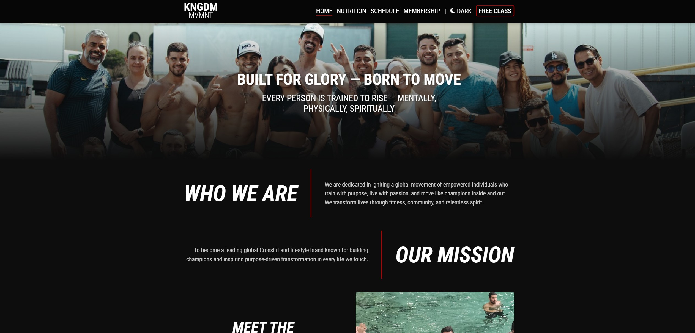
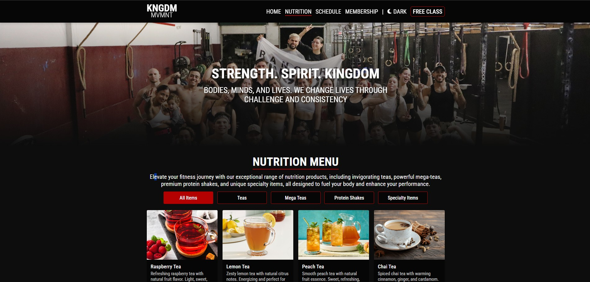
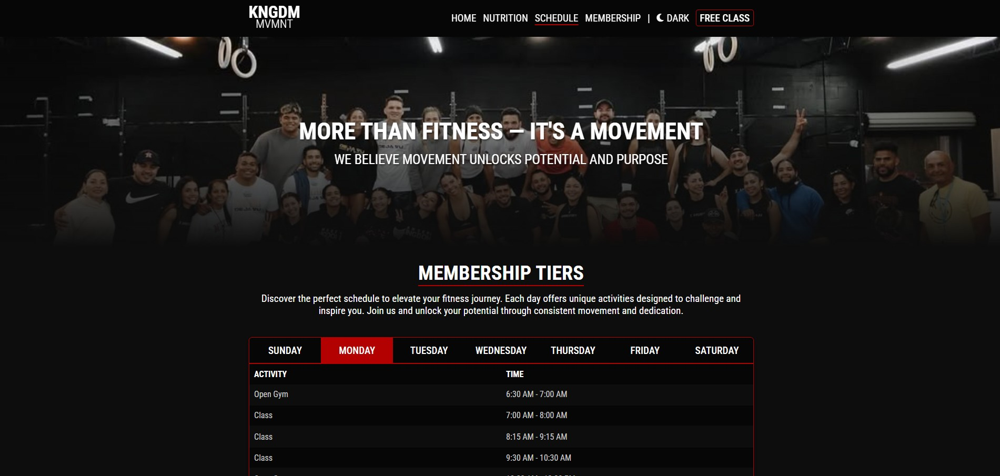
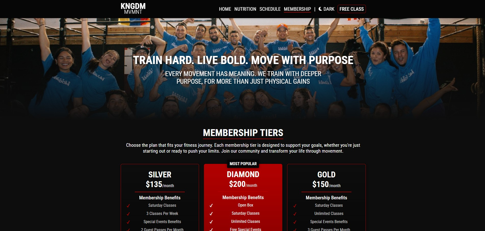
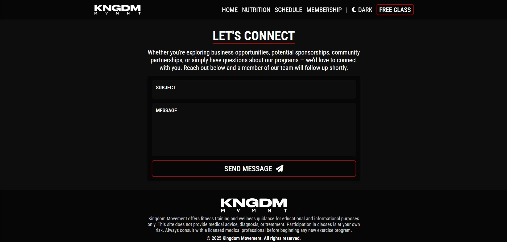
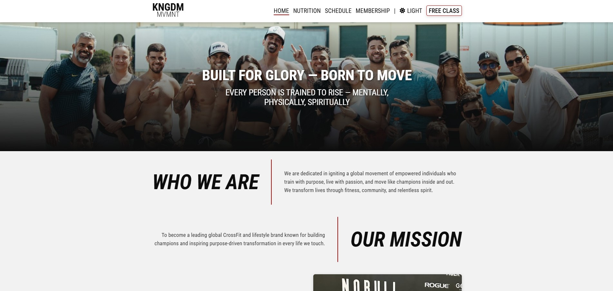

# Kingdom Movement

## Project Summary

Kingdom Movement is a responsive CrossFit gym website showcasing KNGDM MVMNT's fitness community and services. It provides a professional online presence, highlighting membership tiers, class schedules, nutrition services, and community content.

Built with React, Vite, and CSS Modules, the site ensures fast performance, accessibility, and mobile responsiveness. It uses JSON-managed data for memberships, schedules, and nutrition menus, with pages for Home, Membership, Schedule, Nutrition, Contact, and legal policies. The design includes a dark/light theme toggle and aligns with the gym's bold brand identity.

The application fosters community and member engagement through content reflecting the gym's mission of transforming lives through fitness and community. Development adhered to best practices for scalability, maintainability, and accessibility, using modular components and encapsulated styles. Kingdom Movement offers a seamless digital experience, enhancing member engagement and supporting business growth.

## Table of Contents

- [Usage](#usage)
- [Mock-Up](#mock-up)
- [Instructions](#instructions)
- [Key Features](#key-features)
- [Technology Stack](#technology-stack)
- [Deployed Application](#deployed-application)

## Usage

To start the application, run the following commands:

#### 1. Install Dependencies

```bash
npm install
```

#### 2. Run The Development Server

```bash
npm run dev
```

#### 3. Build For Production

```bash
npm run build
```

#### 4. Preview Production Build

```bash
npm run preview
```

## Mock-Up

The following images show the web application's appearance and functionality:



---



---



---



---



---



## Instructions

To use this application, follow these simple steps:

### 1. Clone The Repository

- Download or clone the project to your local machine.

### 2. Install Dependencies

- Run `npm install` in the project root.

### 3. Start The Development Server

- Run `npm run dev` and open the provided local URL in your browser.

### 4. Build and Deploy

This project can be deployed to platforms like Render:

- Run `npm run build` to generate a production build.
- Deploy the contents of the dist folder to your preferred static hosting service.

## Key Features

- **Legal Pages:** Includes Privacy Policy and Terms of Service for compliance and transparency.

- **Contact & Inquiry:** Easy-to-use contact form for membership inquiries and general questions.

- **Theme Toggle:** Seamless dark/light mode switching for enhanced user experience and accessibility.

- **Responsive Design:** Mobile-first approach ensuring optimal viewing across all devices and screen sizes.

- **Interactive Class Schedule:** Day-by-day schedule navigation with real-time class information and activity types.

- **Comprehensive Nutrition Menu:** Categorized nutrition offerings with filtering capabilities and detailed product information.

- **Community-Focused Content:** Brand messaging that emphasizes transformation, community, and purpose-driven fitness.

- **Modern UI/UX:** Clean, energetic design with smooth transitions and interactive elements reflecting the gym's bold brand identity.

- **Dynamic Membership Tiers:** Interactive membership cards showcasing different pricing plans with detailed benefits and features.

## Technology Stack

- **HTML5:** Semantic markup for accessibility and SEO optimization.

- **Vite:** Fast build tool and development server for modern web projects.

- **React:** Component-based UI library for building interactive user interfaces.

- **JavaScript (ES6+):** Modern language features for robust, maintainable code.

- **JSON:** Structured data storage for memberships, schedules, and nutrition items.

- **CSS Custom Properties:** Dynamic theming system for dark/light mode functionality.

- **CSS Modules:** Scoped, maintainable styles with CSS Grid and Flexbox for responsive layouts.

## Deployed Application

[Kingdom Movement](https://kingdom-movement.onrender.com)
