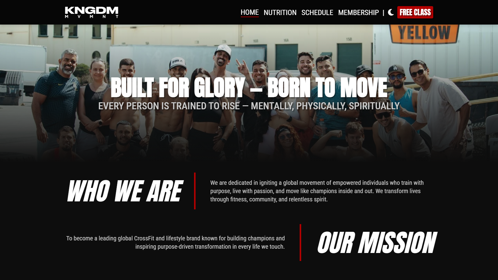
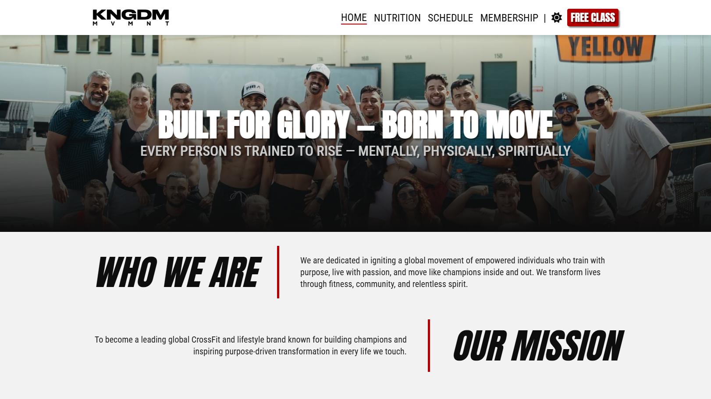
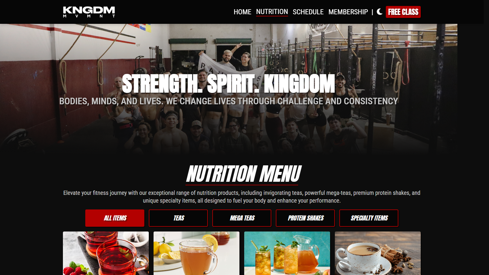
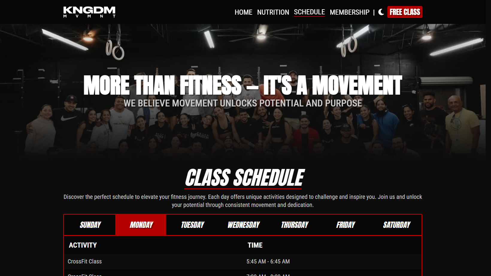
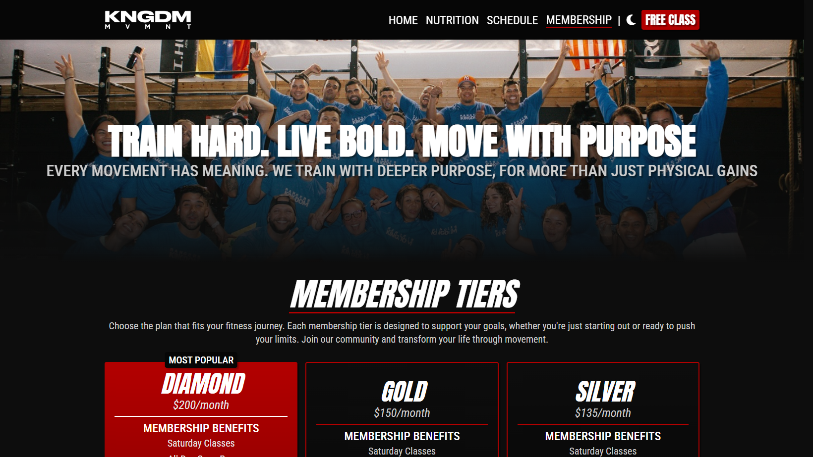

# Kingdom Movement

## Project Summary

Kingdom Movement is a responsive CrossFit gym website showcasing fitness community and services. It provides a professional online presence, highlighting membership tiers, class schedules, nutrition services, and community content.

Built with React, Vite, and CSS Modules, the site ensures fast performance, accessibility, and mobile responsiveness. It uses JSON-managed data for memberships, schedules, and nutrition menus, with pages for Home, Membership, Schedule, Nutrition, Contact, and legal policies. The design includes a dark/light theme toggle and aligns with the gym's bold brand identity.

The application fosters community and member engagement through content reflecting the gym's mission of transforming lives through fitness and community. Development adhered to best practices for scalability, maintainability, and accessibility, using modular components and encapsulated styles. Kingdom Movement offers a seamless digital experience, enhancing member engagement and supporting business growth.

## Table of Contents

- [Mock-Up](#mock-up)
- [Key Features](#key-features)
- [Technology Stack](#technology-stack)

## Mock-Up

The following images show the web application's appearance and functionality:

---

---

---

---

---

---

## Key Features

- **Legal Pages:** Includes Privacy Policy and Terms of Service for compliance and transparency.

- **Contact & Inquiry:** Easy-to-use contact form for membership inquiries and general questions.

- **Theme Toggle:** Seamless dark/light mode switching for enhanced user experience and accessibility.

- **Responsive Design:** Mobile-first approach ensuring optimal viewing across all devices and screen sizes.

- **Interactive Class Schedule:** Day-by-day schedule navigation with real-time class information and activity types.

- **Community-Focused Content:** Brand messaging that emphasizes transformation, community, and purpose-driven fitness.

- **Comprehensive Nutrition Menu:** Categorized nutrition offerings with filtering capabilities and detailed product information.

- **Dynamic Membership Tiers:** Interactive membership cards showcasing different pricing plans with detailed benefits and features.

- **Modern UI/UX:** Clean, energetic design with smooth transitions and interactive elements reflecting the gym's bold brand identity.

## Technology Stack

- **HTML5:** Semantic markup for accessibility and SEO optimization.

- **Vite:** Fast build tool and development server for modern web projects.

- **JavaScript (ES6+):** Modern language features for robust, maintainable code.

- **React:** Component-based UI library for building interactive user interfaces.

- **JSON:** Structured data storage for memberships, schedules, and nutrition items.

- **CSS Custom Properties:** Dynamic theming system for dark/light mode functionality.

- **CSS Modules:** Scoped, maintainable styles with CSS Grid and Flexbox for responsive layouts.
